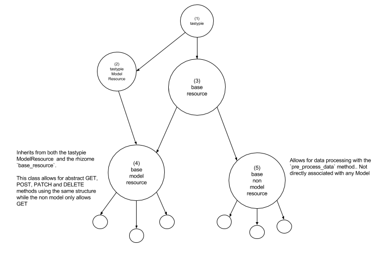

Base Methods
============

We use the `Tastypie <https://django-tastypie.readthedocs.io/en/latest/>`_. package as a baseline for our API, and have modeled our API around the idea of Model Resource, and Non Model Resources.

Model Resources provide basic CRUD functionality for our models.  This means that the format that you use to POST, GET, or DELETE from one resource will be for the most part the same as any other.

Non Model Resources are in essence API calls that trigger the application to do something in the background.  For instance, we call have a NonModelResource that triggers an aggregation refresh for a particular campaign.

Both the Model and the Non Model Resource have a number of options that you can put on the Meta class for instance to say which parameters are needed for at GET or a POST method.  This means that the resources themselves are very lightweight, and that the majority of the logic and code that we have for the API is written in the BaseResources.

The Tastpie package is great for getting started on a CRUD api, but there is alot that happens in the background that makes debugging really difficult, so what we have done is overriden all of the methods that are executed when a request comes in so that we have control and insight into what happens when a request is happening.

BaseResource
++++++++++++

The BaseResource inherits from the `Tastypie Resource Class <https://github.com/django-tastypie/django-tastypie/blob/master/tastypie/resources.py>`_.` and in this method we do two things.

1. Override the Dispatch method, which controls what happens when a request of any kind comes in.
2. Create a method called validate_filters, which makes sure that a GET request has the correct parameters.

.. automethod:: rhizome.api.resources.base_resource.BaseResource.dispatch

.. automethod:: rhizome.api.resources.base_resource.BaseResource.validate_filters

BaseNonModelResource
++++++++++++++++++++

This class is all about using the API to trigger the backend to do something.

This isn't something you would use, but rather something you might hit from cron, in order to process some data on a schedule.

There is only one method here that matters and it is `pre_process_data`.  If you want to create an api resource that does something in the backend, you can simply extend this class, then override the method below to do whatever you want.

After running this method, the api will return whatever is in the `queryset` atttribute of the meta class.

.. autoclass:: rhizome.api.resources.base_non_model.BaseNonModelResource

As an example, check out what happens when we hit the `transform_upload` api for a particular document

.. automethod:: rhizome.api.resources.doc_trans_form.DocTransFormResource.pre_process_data

BaseModelResource
+++++++++++++++++

The BaseModelResource offers a full CRUD interface for the resources that extend it.  The idea is that, with very lttle work you can create an interface for a django model by setting a few attributes in the Meta class.

In order to set up a model resource, you must at most set up two attributes in the meta class
 - **resource_name** : This is the namespace that we access when we interface with a resource, i.e. /api/v1/<resource_name>
 - **object_class** : This refers to the Model that you want to interface with.  All of the CRUD applications for a resource will be executed against this model.

GET (by PK)
^^^^^^^^^^^

::

  GET : /api/v1/campaign/1/

returns to us a single object.

::

  {
    campaign_type_id: 1,
    created_at: "2016-05-04T02:31:29.227679",
    end_date: "2016-02-29",
    id: 1,
    name: "February 2016 - SNID - OPV ",
    start_date: "2016-02-02"
  }

A GET request in which a primary key is passed is routed via the ``dispatch`` method to the ``obj_get`` method.

.. automethod:: rhizome.api.resources.base_model.BaseModelResource.obj_get

GET (with query filters)
^^^^^^^^^^^^^^^^^^^^^^^^

A get requests can be used to access an object via primary key, but it is also possible to send query filters and get in the response the objects that match.

For instance a query like:

::

  GET : /api/v1/indicator/
  PARAMS: {name"Polio Cases"}

or

::

  GET: /api/v1/indicator/
  PARAMS: {id__gt: 130}

Filters the indicator resource in accordance to the filters passed.

These filters are based directly off of the `Django ORM Filters <https://docs.djangoproject.com/en/1.10/ref/models/querysets/#field-lookups>`_.`.

This is a bit of an over simplification of what happens when we filter, but it should give a good idea of how we take advantage of the djano ORM to return relevant data to the application.

.. code-block:: python

  query_filters = request.GET
  model_class = self._meta.object_class
  fields_to_return = self._meta.object_class

  queryset = model_class.objects.filter(query_filters).values(fields_to_return)
  # queryset = Location.objects.filter({name:'NYC'}).values(['id','name','parent_location__name'])
  return queryset

this type of filtering is handled via the ``obj_get_list`` method

.. automethod:: rhizome.api.resources.base_model.BaseModelResource.obj_get_list

.. automethod:: rhizome.api.resources.base_model.BaseModelResource.apply_filters

.. automethod:: rhizome.api.resources.base_model.BaseModelResource.get_object_list

**Note**:  Django queryset are `lazy` which means that we can pass them around and alter them with the ``filter`` syntax, see `here <https://docs.djangoproject.com/en/1.10/topics/db/queries/#querysets-are-lazy>`_`

POST
^^^^

Certain models have non nullable fields, which means that you need to set up the `required_fields_for_post` parameter in the meta class, so that if the API does not receive this in the request, it can formulate a sensible error message, as opposed to returning the integrity error message from the database.

The POST requests are handled in the ``obj_create`` method and while you have the freedom to override this ( see api/v1/document ) to handle a particular use case, the obj_create uses the Meta attributes defined in the resource to validate and Create objects.

.. automethod:: rhizome.api.resources.base_model.BaseModelResource.obj_create

PATCH
^^^^^

When updating a resource, submit a PATCH request with the fields you want to update as parameters.

::

  PATCH /api/v1/indicator/123/
  PARAMS {'name': 'a new name for indicator 123'}

.. automethod:: rhizome.api.resources.base_model.BaseModelResource.obj_update

DELETE
^^^^^^

The API allows for traditional REST deletion protocol

::

  DELETE /api/v1/custom_chart/123/

.. automethod:: rhizome.api.resources.base_model.BaseModelResource.obj_delete

We can also delete by using query parameters but only by using the ID. This is because we have some legacy code ( in manage system when we delete ``calculated_indicator_compoents`` and ``indicator_to_tag`` relations ) that deletes w

Moving forward, please use the ``DELETE /api/v1/resource/<pk>/`` request format in deleteing resources.

Note, if you try to delete a list of objects with the ``obj_delete_list`` method, you will get an error saying that you

It is reasonable however to want to delete a list of resources all at once with a particular query filter, for instance you want to delete all tags from an indicator.  If so, then the ``obj_delete_list`` method is where that would happen.

::

  DELETE /api/v1/custom_chart/?id=123

.. automethod:: rhizome.api.resources.base_model.BaseModelResource.obj_delete_list

GET Schema
^^^^^^^^^^

Since we override Tastypie's model resource In order to get the schema

For instance

::

  /api/v1/indicator/schema

will return to you the information needed about each field of the resource as well as which methods can be applied

For more information on this, research `Inspecting the Resource Schema <http://django-tastypie.readthedocs.io/en/latest/interacting.html#inspecting-the-resource-s-schema>`_.`

Get Locations From URL
^^^^^^^^^^^^^^^^^^^^^^

The most important model used in the Base Model Resource is the ``get_locations_to_return_from_url`` method.

There are four main resources for which this method applies:

 - /api/v1/location
 - /api/v1/geo
 - /api/v1/date_datapoint
 - /api/v1/campaign_datapoint

These API methods all need to get locations in some way and thus all use this method to take particular query parameters in order to return the appropriate locations to the application.

The following parameters are available and filter locations as described.

- ``location_id__in`` : If this parameter is passed, then these are the exact locations that will be received in the response.  This type of filter is sent when you now that you want a specific list of location with no aggregation.
- ``location_id`` &  ``location_type`` : This means that you want all of the locations of a particular type, underneath the location given.  So for instance, if you wanted to say, `show me all districts in Afghanistan` you would use these two parameters.
- ``location_id`` &  ``location_depth`` : This means that you want data underneath a particular location, at a particular level of depth.

If you pass ``location_id=<Afghanistan>&location_depth=0`` that will give you Afghanistan only, but ``location_id=<Afghanistan>&location_depth=1`` will give you the direct children ( Regions ) of Afghanistan and ``location_id=<Afghanistan>&location_depth=2`` will give you the grandchildren ( provinces ).  This is used in the "drill down" functionality so that if for instance you are looking at a map of a particular Indicator at Afghanistan level and the data is rendering for the Regions, when you drill down to a particular region, using this filter, the application will return the Provinces underneath the region you select. The custom chart functionality relies heavily on the location_depth parameter which gives sensible charts at all location levels

In addition to the functionality above which is used widely throughout the application, we also allow for an additional filter of locations based on particular indicator values.  This could be used for instance, to filter a list of locations to those that are not under government control.

- ``filter_indicator`` && ``filter_value``

for more on this, take a look at: ``get_locations_from_filter_param``

.. automethod:: rhizome.api.resources.base_model.BaseModelResource.get_locations_to_return_from_url
