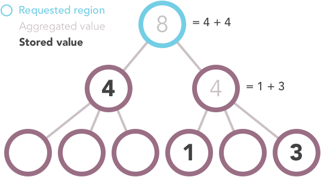

Backend Principle Components
============================

Data Ingestion and Aggregation
------------------------------

Aggregation by location
+++++++++++++++++++++++

If you request a location for which there is no data, the system will traverse the
hierarchy of locations down and aggregate certain data that it finds at those levels by
adding them together. For example, if you request the "Number of Missed
Children" for Nigeria, but that indicator is not stored in the database for
Nigeria, the system will iterate over the states that comprise Nigeria and add
the values it finds for that indicator together. For each state that does not
have a value, it will check its constituent locations, and so on until it finds a
location with a value for that indicator or it runs out of sub-locations to check.

.. image:: img/geo_agg.png

Note that the aggregation behavior varies depending on the indicator datatype.
  - Integer type indicators will have data aggregated by location as above.
  - Percent type indicators will not be aggregated
  - Boolean type indicators for lower level locations, such as districts, will be aggregated as percents when propagated to upper level locations. For example, a province with 5 districts with evening meetings and and 5 without evening meetings, would have a 50% value overall for evening meetings.

If the value of an indicator was generated by aggregating data from sub-locations,
the indicator object will have an ``is_agg`` property:

.. code-block:: json

  ...
  location: 23,
  indicators: [{
    indicator: 1,
    value: ...
  }, {
    indicator: 2,
    value: ...,
    is_agg: true
  }]
  ...

In the above example, a value for indicator 1 was found for location 23. No value
for indicator 2 was found for location 23, so the system calculated that value by
aggregating the values of it sub-locations.

Conflicts with Sub-locations
++++++++++++++++++++++++++++

If a value is stored for a given location, that is the value returned regardless
of whether or not the location's sub-locations also have values. Because there is
nothing preventing a value being stored for a location and its sub-locations, it is
possible that the stored values at differing levels may conflict.

.. image:: img/geo_agg_conflict.png

In the above example one of the locations has a stored value of 7, and its three
sub-locations have values of 1, 1, and 3. This could be indicative of an error in
the data and should be flagged. Regardless of whether this is an error or
intentional, the value returned for that location (and the value used in
aggregation for any of its parent locations) is the value stored for the location;
the values in the sub-locations are ignored except when they are explicitly
requested.

Partial Missing Values
++++++++++++++++++++++

When aggregating data geographically, it is possible to calculate the value for
a location even if not all of its sub-locations have data.

These situations should be flagged so that users are aware of them when they
occur. It's important to know that the value for the country you are seeing is
actually only representative of some portion of its sub-locations and not the
entire country.

Aggregation by calculation
++++++++++++++++++++++++++
Certain indicators are calculated from other indicators. For example, "total missed children" is the sum of "missed due to absence" and "missed due to refusal". Though "total missed children" may not exist in a source submission, an agg task can calculate its value based on its child indicators. Calculated indicators can be generated by designating child indicators in CalculatedIndicatorComponent objects. Calculation types of CalculatedIndicatorComponents include 'PART_TO_BE_SUMMED' for calculated indicators that are generated as a sum, and 'NUMERATOR' and 'DENOMINATOR' CalculatedIndicatorComponents for generating percent indicators. Similarly components can be designated as 'PART_OF_DIFFERENCE' and 'WHOLE_OF_DIFFERENCE' for the percentage calculation: 
::
WHOLE_OF_DIFFERENCE(x) - PART_OF_DIFFERENCE(y)
-----------------------------------------
WHOLE_OF_DIFFERENCE(x)

Conflicts with calculation aggregation and partial missing values
+++++++++++++++++++++++++++++++++++++++++++++++++++++++++++++++++
Similar to location aggregation, an aggregated indicator value will be overridden if the indicator value has been set explicitly. Also, for calculated indicators that are computed as a sum, if any 'PART_TO_BE_SUMMED' component is missing a datapoint, the sum skips over this component. For example, if a datapoint value exists for the indicator 'missed due to absence', but not for 'missed due to refusal', the 'total missed childen' indicator sum will be the value of 'missed due to absence'.
