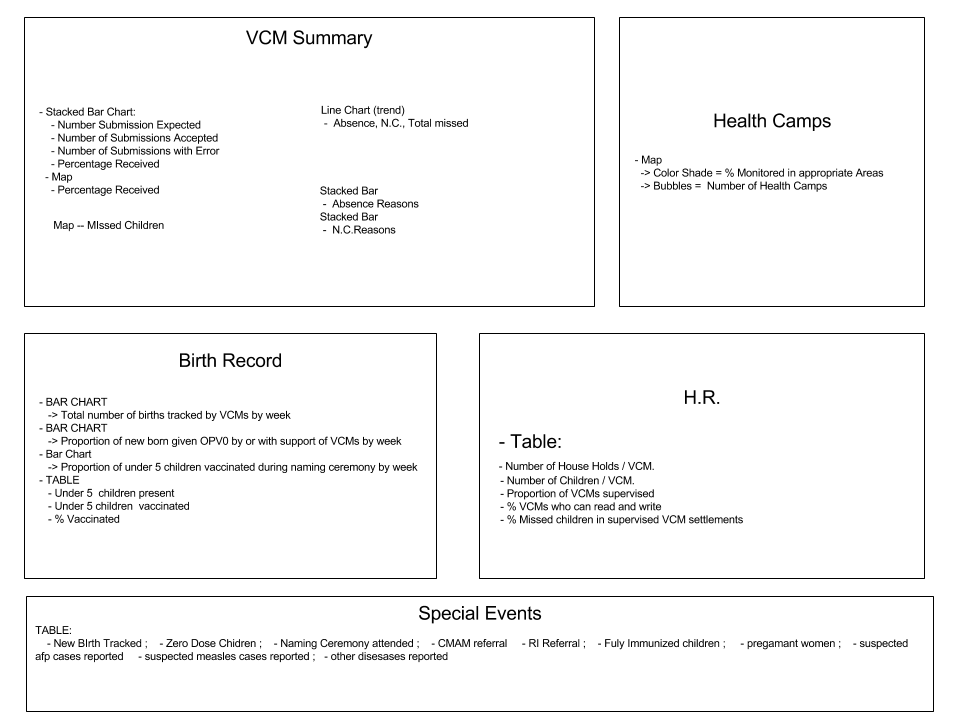

*************
ODK Dashboard
*************

Overview
========

- This dashboard takes a parameter for:
    -> Location ( Nigeria, Kano)
    -> Campaign

- Same data shows for Nigeria, and Kano but at different levels.

VCM Summary:
== VCM SUBMISSION REPORT ==
    - Stacked Bar Chart:
      - Number Submission Expected
      - Number of Submissions Accepted
      - Number of Submissions with Error
      - Percentage Received
    - Map
      - Percentage Received

=== Special Events ===
  - TABLE:
    - New BIrth Tracked
    - Zero Dose Chidren
    - Naming Ceremony attended
    - CMAM referral
    - RI Referral
    - Fuly Immunized children
    - pregamant women
    - suspected afp cases reported
    - suspected measles cases reported
    - other disesases reported
  - BAR CHART:
    -> Proportion of children Vaccinated.
        ( break down by location )

Birth Register:
  - BAR CHART:
     -> Total number of births tracked by VCMs by week
  - BAR CHART
     -> Proportion of new born given OPV0 by or with support of VCMs by week
  - Bar Chart
     -> Proportion of under 5 children vaccinated during naming ceremony by week
  - TABLE
     - Under 5  children present
     - Under 5 children  vaccinated
     - % Vaccinated

H.R.
  - Table:
    - Number of House Holds / VCM.
    - Number of Children / VCM.
    - Proportion of VCMs supervised
    - % VCMs who can read and write
    - % Missed children in supervised VCM settlements

Health Camps:
  - Map
    -> Color Shade = % Monitored in appropriate Public Areas
    -> Bubbles =  Number of Health Camps
  - Pie Chart
    -> Breakdown of % of health camp locations
        ( 70% Kano, 10% bauchi, 20% Kaduna ect.)
